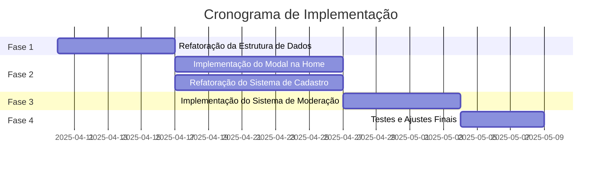
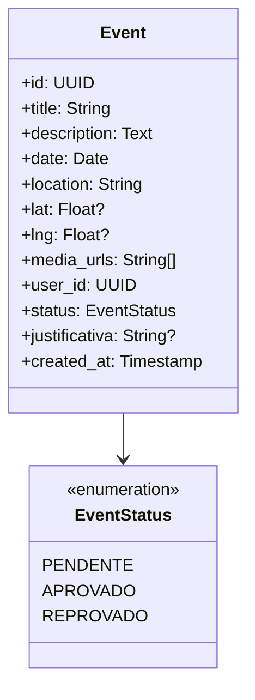
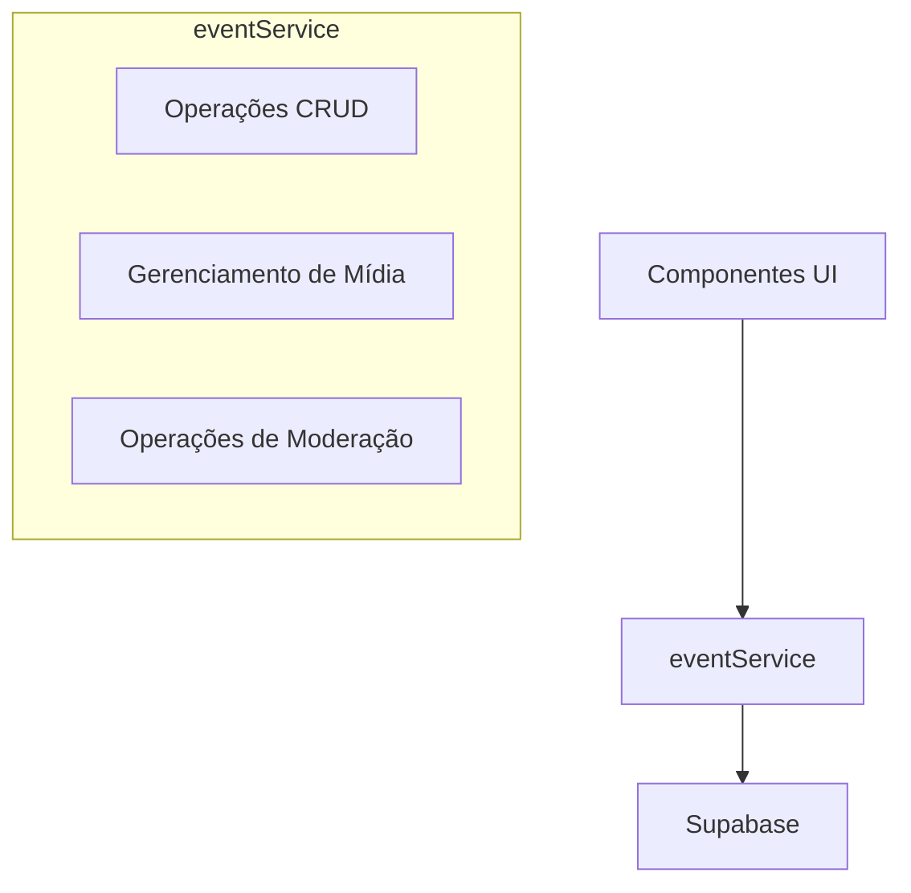
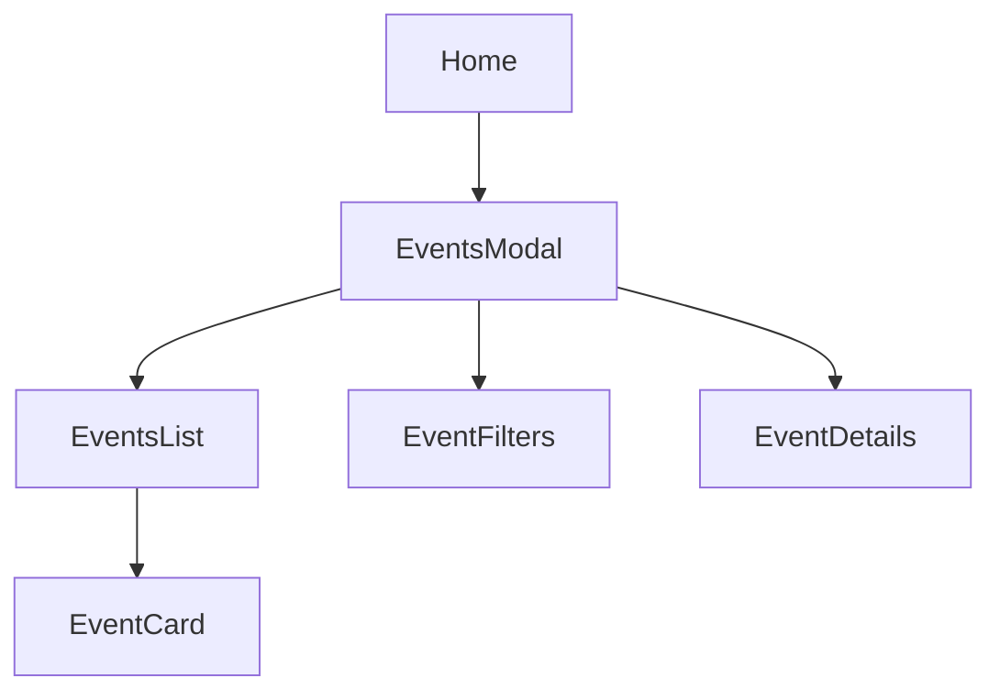
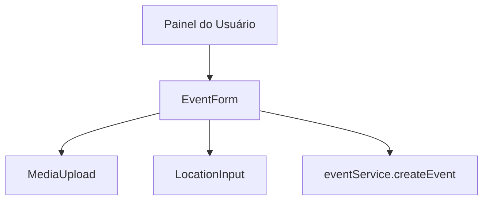
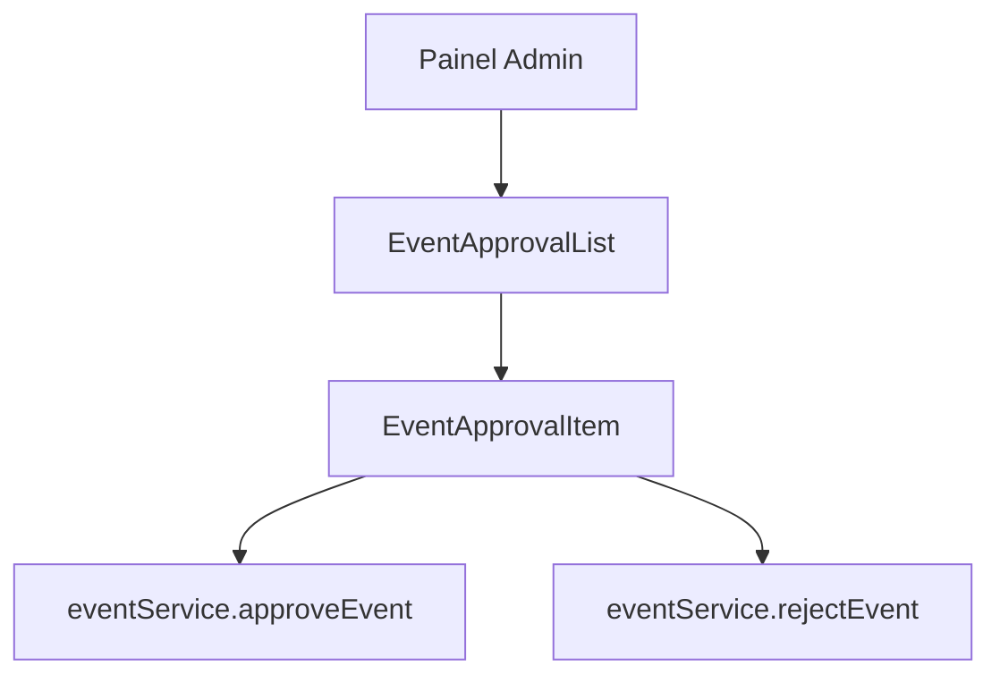
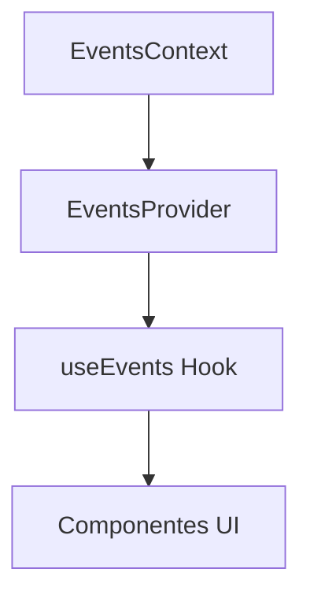

# Plano de Implementação: Módulo de Eventos Christianitatis.org

Este documento apresenta um plano detalhado para a refatoração e implementação do Módulo de Eventos do Christianitatis.org, alinhando o código existente com a documentação técnica e funcional.

## Sumário Executivo

Após análise do código atual e da documentação fornecida, identificamos a necessidade de uma refatoração profunda para resolver inconsistências de tipos e melhorar a integração entre componentes. O plano abaixo divide a implementação em fases lógicas, priorizando igualmente a visualização pública e o sistema de cadastro/moderação.

## Fase 1: Refatoração da Estrutura de Dados

### 1.1 Unificação dos Tipos e Interfaces

#### Tarefas:

1. **Atualizar `src/types/Event.ts`**:

   - Alinhar com a estrutura da tabela Supabase conforme documentação
   - Remover interfaces duplicadas e consolidar tipos

2. **Criar mapeamentos entre tipos do Supabase e da aplicação**:

   - Implementar funções de conversão para garantir consistência

3. **Documentar o modelo de dados**:
   - Criar documentação clara sobre a estrutura e relacionamentos

### 1.2 Centralização dos Serviços

#### Tarefas:

1. **Refatorar `src/services/eventService.ts`**:

   - Implementar todas as operações necessárias conforme documentação
   - Remover acessos diretos ao Supabase de outros componentes
   - Adicionar validações de entrada

2. **Implementar serviço de mídia**:

   - Criar funções para upload e gerenciamento de mídia
   - Integrar com Supabase Storage conforme regras de segurança

3. **Documentar API do serviço**:
   - Criar documentação clara sobre cada função e seu comportamento esperado

## Fase 2A: Implementação do Modal na Home

### 2A.1 Componente Modal de Eventos

#### Tarefas:

1. **Criar componente `EventsModal`**:

   - Implementar modal interativo e responsivo
   - Integrar com a Home

2. **Refatorar `EventsList` e `EventCard`**:

   - Adaptar para exibição no modal
   - Implementar layout responsivo conforme documentação

3. **Implementar filtros**:

   - Filtro por data
   - Filtro por localização/proximidade

4. **Implementar visualização detalhada**:
   - Modal de detalhes com descrição completa e mídias

### 2A.2 Integração com a Home

#### Tarefas:

1. **Adicionar botão/menu na Home**:

   - Implementar acesso ao modal de eventos
   - Garantir experiência fluida

2. **Implementar carregamento otimizado**:
   - Lazy loading para mídias
   - Paginação ou infinite scroll

## Fase 2B: Refatoração do Sistema de Cadastro

### 2B.1 Formulário de Cadastro de Eventos

#### Tarefas:

1. **Refatorar `EventForm`**:

   - Alinhar com a estrutura de dados atualizada
   - Implementar validações conforme regras de negócio
   - Garantir que pelo menos uma mídia seja obrigatória

2. **Implementar `MediaUpload`**:

   - Criar componente para upload de imagens/vídeos
   - Integrar com Supabase Storage
   - Implementar preview e gerenciamento de arquivos

3. **Implementar `LocationInput`**:
   - Criar componente para entrada de localização
   - Opcionalmente integrar com API de geolocalização

### 2B.2 Integração com Autenticação

#### Tarefas:

1. **Garantir proteção de rotas**:

   - Implementar redirecionamento para login quando necessário
   - Verificar permissões do usuário

2. **Integrar com Supabase Auth**:
   - Garantir que o user_id seja corretamente associado aos eventos

## Fase 3: Implementação do Sistema de Moderação

### 3.1 Painel de Moderação

#### Tarefas:

1. **Refatorar `ApprovalList`**:

   - Implementar listagem de eventos pendentes
   - Adicionar filtros e ordenação

2. **Implementar visualização detalhada para moderação**:

   - Exibir todas as informações do evento
   - Mostrar mídias para avaliação

3. **Implementar ações de moderação**:
   - Aprovar evento
   - Reprovar evento com justificativa
   - Opções rápidas de reprovação

### 3.2 Notificações

#### Tarefas:

1. **Implementar sistema de notificações**:
   - Notificar usuário sobre aprovação/reprovação
   - Notificar administradores sobre novos eventos pendentes

## Fase 4: Testes e Ajustes Finais

### 4.1 Testes Automatizados

#### Tarefas:

1. **Implementar testes unitários**:

   - Testar serviços e funções de utilidade
   - Garantir cobertura adequada

2. **Implementar testes de integração**:

   - Testar fluxos completos
   - Verificar integração com Supabase

3. **Implementar testes de UI**:
   - Testar componentes visuais
   - Verificar responsividade

### 4.2 Testes Manuais

#### Tarefas:

1. **Executar casos de teste conforme documentação**:

   - Cadastro sem mídia → erro
   - Cadastro com todos os campos corretos → sucesso
   - Moderador aprova evento → status muda
   - Moderador reprova sem justificativa → erro
   - Usuário não autenticado → sem acesso ao formulário de evento
   - Visualização pública → lista apenas eventos aprovados

2. **Verificar experiência do usuário**:
   - Testar em diferentes dispositivos
   - Verificar acessibilidade

### 4.3 Ajustes e Otimizações

#### Tarefas:

1. **Resolver problemas identificados nos testes**:

   - Corrigir bugs e inconsistências
   - Melhorar desempenho quando necessário

2. **Otimizar carregamento de mídias**:

   - Implementar lazy loading
   - Otimizar tamanho de imagens

3. **Documentação final**:
   - Atualizar documentação técnica
   - Criar documentação para usuários finais

## Considerações Técnicas

### Gerenciamento de Estado

Recomendamos a implementação de um contexto global para eventos, utilizando React Context API ou uma biblioteca como Redux ou Zustand. Isso facilitará a comunicação entre componentes e garantirá consistência nos dados.

### Otimização de Performance

Para garantir uma experiência fluida, especialmente no modal da Home, recomendamos:

1. **Virtualização de listas** para renderizar apenas os itens visíveis
2. **Lazy loading de imagens** para carregar apenas quando necessário
3. **Memoização de componentes** para evitar re-renderizações desnecessárias

### Segurança

Implementar verificações de segurança em múltiplas camadas:

1. **Frontend**: Verificar permissões antes de exibir opções sensíveis
2. **Serviço**: Validar dados e permissões antes de enviar ao backend
3. **Backend**: Implementar regras de segurança no Supabase (RLS)

## Conclusão

Este plano de implementação aborda as principais necessidades identificadas na documentação técnica e funcional do Módulo de Eventos do Christianitatis.org. A abordagem de refatoração profunda permitirá resolver as inconsistências de tipos e melhorar a integração entre componentes, resultando em um sistema robusto e alinhado com as expectativas.

Recomendamos iniciar pela Fase 1 (Refatoração da Estrutura de Dados) para estabelecer uma base sólida, e então prosseguir com as Fases 2A e 2B em paralelo, dependendo dos recursos disponíveis.
