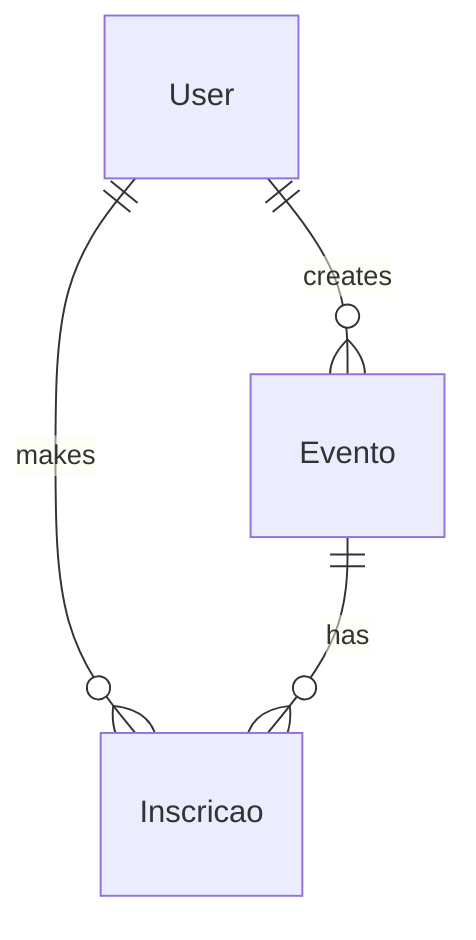
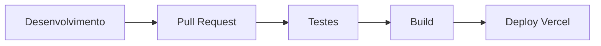

# Arquitetura do Projeto Christianitatis

## Visão Geral

O Christianitatis é uma aplicação web moderna construída com:

- React + Vite
- TypeScript
- Supabase (Backend as a Service)
- TailwindCSS
- Vercel (Deploy)

## Estrutura de Diretórios

```
christianitatis/
├── src/               # Código fonte da aplicação
│   ├── components/    # Componentes React reutilizáveis
│   ├── contexts/      # Contextos React (Auth, Theme, etc)
│   ├── hooks/         # Custom hooks
│   ├── pages/         # Páginas/rotas da aplicação
│   ├── services/      # Serviços (API, Auth, etc)
│   ├── styles/        # Estilos globais e utilitários
│   ├── types/         # Definições de tipos TypeScript
│   └── utils/         # Funções utilitárias
├── public/            # Arquivos estáticos
├── docs/              # Documentação
└── scripts/           # Scripts de automação
```

## Tecnologias Principais

### Frontend
- **React 18**: Framework UI principal
- **Vite**: Build tool e dev server
- **TypeScript**: Tipagem estática
- **TailwindCSS**: Estilização
- **React Router**: Roteamento
- **React Query**: Gerenciamento de estado e cache
- **React Hook Form**: Gerenciamento de formulários
- **Zod**: Validação de dados
- **Vitest**: Testes unitários
- **Testing Library**: Testes de componentes
- **Storybook**: Documentação de componentes

### Backend (Supabase)
- **PostgreSQL**: Banco de dados principal
- **PostgREST**: API RESTful automática
- **GoTrue**: Autenticação
- **Storage**: Armazenamento de arquivos
- **Edge Functions**: Funções serverless
- **Realtime**: Subscriptions em tempo real

### DevOps
- **GitHub Actions**: CI/CD
- **Vercel**: Hosting e deploy
- **Husky**: Git hooks
- **ESLint/Prettier**: Linting e formatação

## Ambientes e Configurações

### Desenvolvimento Local

```bash
# .env.local
VITE_APP_ENV=development
VITE_SUPABASE_URL=***
VITE_SUPABASE_ANON_KEY=***
```

Características:

- Hot reload ativo
- Ferramentas de debug
- Logs detalhados
- Supabase local/dev

### Homologação

```bash
# .env.staging
VITE_APP_ENV=staging
VITE_SUPABASE_URL=***
VITE_SUPABASE_ANON_KEY=***
```

Características:

- Ambiente espelho de produção
- Dados de teste
- Monitoramento ativo
- Supabase staging

### Produção

```bash
# .env.production + .env.vercel
VITE_APP_ENV=production
VITE_SUPABASE_URL=***
VITE_SUPABASE_ANON_KEY=***
```

Características:

- Otimizações de performance
- Segurança reforçada
- Analytics
- Supabase produção

## Arquitetura de Dados

### Modelos Principais

1. **User**
   ```typescript
   interface User {
     id: string
     email: string
     nome: string
     role: 'admin' | 'coordenador' | 'usuario'
     diocese?: string
     paroquia?: string
     created_at: string
     updated_at: string
   }
   ```

2. **Evento**
   ```typescript
   interface Evento {
     id: string
     titulo: string
     descricao: string
     data_inicio: string
     data_fim: string
     local: string
     tipo: 'retiro' | 'formacao' | 'encontro'
     vagas: number
     status: 'draft' | 'published' | 'cancelled'
     created_by: string
     created_at: string
     updated_at: string
   }
   ```

3. **Inscricao**
   ```typescript
   interface Inscricao {
     id: string
     evento_id: string
     user_id: string
     status: 'pending' | 'confirmed' | 'cancelled'
     created_at: string
     updated_at: string
   }
   ```

### Relacionamentos



## Fluxo de Autenticação

1. **Login/Registro**

   - Via Supabase Auth
   - Armazenamento seguro de tokens
   - Refresh automático de sessão

2. **Autorização**
   - Roles: Admin, Coordenador, Usuário
   - Guards nas rotas
   - Validação de permissões

## Padrões de Código

### Componentes React

```typescript
// Estrutura de Componente
import React from 'react'
import styles from './Component.module.css'

interface ComponentProps {
  // props tipadas
}

export const Component: React.FC<ComponentProps> = ({ ...props }) => {
  return (...)
}
```

### Hooks Customizados

```typescript
// Estrutura de Hook
import { useState, useEffect } from 'react'

export const useCustomHook = (params: Type) => {
  // lógica do hook
  return { data, methods }
}
```

### Tratamento de Erros

```typescript
// Error Boundary Component
class ErrorBoundary extends React.Component<Props, State> {
  static getDerivedStateFromError(error: Error) {
    return { hasError: true, error }
  }

  componentDidCatch(error: Error, errorInfo: React.ErrorInfo) {
    console.error('Error caught by boundary:', error, errorInfo)
  }

  render() {
    if (this.state.hasError) {
      return <ErrorFallback error={this.state.error} />
    }
    return this.props.children
  }
}
```

## Pipeline de Deploy



## Segurança

1. **Headers HTTP**

   - CSP configurado
   - CORS restrito
   - XSS Protection

2. **Dados Sensíveis**
   - Variáveis de ambiente
   - Secrets no Vercel
   - Tokens encriptados

3. **Práticas de Segurança**
   - Sanitização de inputs
   - Validação de dados
   - Rate limiting
   - Proteção contra CSRF
   - Auditoria de logs

## Performance

1. **Otimizações**

   - Code splitting
   - Lazy loading
   - Caching
   - Compressão de imagens
   - Minificação de assets

2. **Monitoramento**
   - Vercel Analytics
   - Error tracking
   - Performance metrics
   - User analytics
   - Logs de servidor

3. **Métricas Principais**
   - First Contentful Paint (FCP)
   - Largest Contentful Paint (LCP)
   - Time to Interactive (TTI)
   - First Input Delay (FID)
   - Cumulative Layout Shift (CLS)

## Manutenção

1. **Updates**

   - Dependências atualizadas mensalmente
   - Security patches prioritários
   - Breaking changes documentados

2. **Backups**
   - Supabase: diário
   - Código: GitHub
   - Configurações: documentadas

3. **Monitoramento**
   - Logs de erro
   - Métricas de performance
   - Uso de recursos
   - Alertas automáticos

## Próximos Passos

1. **Curto Prazo**

   - Implementar testes E2E
   - Melhorar cobertura de testes
   - Documentação de API
   - Otimização de imagens
   - Cache layer

2. **Médio Prazo**

   - PWA support
   - Internacionalização
   - Analytics avançado
   - Sistema de notificações
   - Área administrativa

3. **Longo Prazo**
   - Microsserviços
   - Cache distribuído
   - CDN customizado
   - Machine Learning
   - Chatbot de suporte

## Guias de Contribuição

1. **Setup do Ambiente**
   - Instalação de dependências
   - Configuração do editor
   - Extensões recomendadas
   - Scripts úteis

2. **Processo de Desenvolvimento**
   - Criação de branches
   - Commits semânticos
   - Code review
   - Merge requests

3. **Qualidade de Código**
   - Testes unitários
   - Testes de integração
   - Code coverage
   - Linting e formatação

4. **Documentação**
   - Comentários de código
   - README atualizado
   - Changelog
   - Storybook
